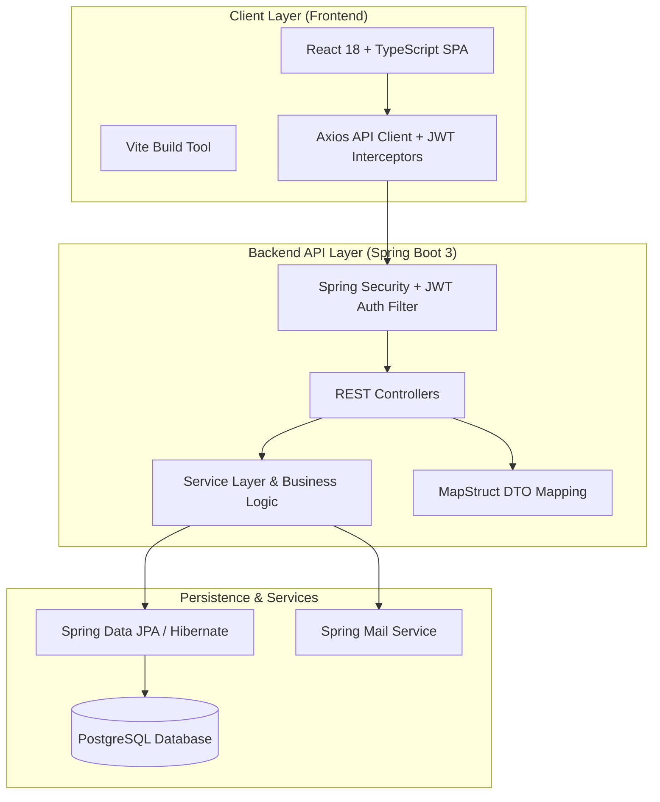

# College Event & Operations Management System (CEOMS)

     

CEOMS is an enterprise-grade full-stack platform designed to streamline end-to-end college event management, ticketing, attendance, operations, budget approvals, vendor management, and analytics.

---

## Architecture Diagram



---

## Tech Stack

| Layer | Technology |
|-------|------------|
| **Backend** | Java 21, Spring Boot 3.2, Spring Security (JWT), Spring Data JPA, MapStruct, Lombok |
| **Frontend** | React 18, TypeScript, Vite, Tailwind CSS, Axios, Lucide Icons |
| **API Specs** | Swagger UI / OpenAPI 3 (`/swagger-ui.html`) |
| **Database** | PostgreSQL 16 (H2 for zero-dependency local testing) |
| **Containers & CI** | Docker, Docker Compose, Nginx, GitHub Actions Workflow |

---

## System Features

- **Authentication & Roles** – JWT Authentication, Role-based access control (Student, Organizer, Faculty, Admin).
- **Event Lifecycle** – Creation, draft, approval workflow, ticketing, QR code check-in.
- **Attendance & Check-in** – Live QR code scanner for event check-in and attendance export.
- **Budgeting & Expenses** – Approval workflows for event budgets and vendor invoices.
- **Support & Operations** – Infrastructure requests, venue booking, sound/lighting requests.
- **Analytics & Dashboard** – Real-time metrics for event attendance, budget utilization, and popular event categories.

---

## Setup & Deployment

### Option 1: Docker Compose (1-Command Full Stack)

Spin up PostgreSQL, Spring Boot Backend, and React Nginx Frontend together:

```bash
docker-compose up --build -d
```

Access Points:
- **Frontend SPA**: `http://localhost:3000`
- **Backend API**: `http://localhost:8080/api/v1`
- **Swagger Documentation**: `http://localhost:8080/api/v1/swagger-ui.html`

### Option 2: Local Development

#### 1. Backend Setup
```bash
cd backend
mvn clean test package
mvn spring-boot:run
```

#### 2. Frontend Setup
```bash
cd frontend
npm install
npm run dev
```

---

## Testing & Continuous Integration

### Local Test Suite (H2 In-Memory DB)
```bash
mvn test -f backend/pom.xml
```

### Automated CI Pipeline
The repository includes a GitHub Actions workflow (`.github/workflows/ci.yml`) that automatically builds, tests, and lints both backend Java 21 services and frontend React packages on every pull request.

---

## License

MIT License – Built for full-stack Java and React portfolio development.
